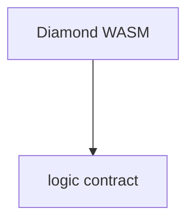

# just a blazor wasm

## cheat with me

### frontend

- [css reset](https://www.joshwcomeau.com/css/custom-css-reset/)
- [favicon](https://evilmartians.com/chronicles/how-to-favicon-in-2021-six-files-that-fit-most-needs)

## domain details

### data layer

#### weather api

- [current weather (open meteo)](https://open-meteo.com/en/docs?forecast_days=1&timezone=auto&latitude=51.0509&longitude=13.7383&forecast_hours=1&current=temperature_2m,is_day&wind_speed_unit=ms)

## architecture

